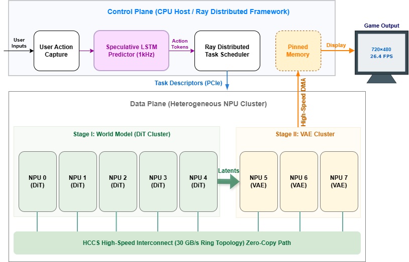

# Zeng Wei — Personal Academic Portfolio

A clean, dark-themed personal portfolio website for AI for Games research, designed for GitHub Pages deployment. Includes a technical blog system with Markdown rendering, code highlighting, and LaTeX math support.

## Quick Start

### Local Preview

Simply open `index.html` in your browser, or use a local server:

```bash
# Python 3
python -m http.server 8000

# Then visit: http://localhost:8000
```

### Deploy to GitHub Pages

1. Create a new GitHub repository (e.g., `zengwei-code.github.io` for a user site, or any repo name for a project site).
2. Copy all files from this folder to the repository root.
3. Push to GitHub:
   ```bash
   git init
   git add .
   git commit -m "Initial portfolio"
   git remote add origin https://github.com/zengwei-code/zengwei-code.github.io.git
   git branch -M main
   git push -u origin main
   ```
4. Go to repo **Settings** → **Pages** → set Source to `main` branch, root `/`.
5. Your site will be live at `https://zengwei-code.github.io` within minutes.

## How to Update Content

### Add News

Open `index.html`, find the `<!-- NEWS SECTION -->` comment, and copy-paste a news item block at the **top** of the list:

```html
<div class="news-item reveal">
  <span class="news-date">2026.XX</span>
  <span class="news-badge new">New</span>
  <p>Your news description here.</p>
</div>
```

### Add a Paper

Copy the `paper-card` div structure and modify the title, authors, links, and highlights.

### Add Paper Figure / Demo

Replace the placeholder in the research section:

```html
<!-- Replace the paper-figure-placeholder div with: -->
<div class="paper-figure">
  
</div>
```

For a demo video:
```html
<div class="paper-figure">
  <video autoplay loop muted playsinline style="width:100%; border-radius:12px;">
    <source src="assets/demo.mp4" type="video/mp4">
  </video>
</div>
```

### Update Skills / Experience

Find the corresponding section in `index.html` and edit the HTML directly. Each section is clearly commented.

---

## Blog System

The blog supports Markdown articles with code syntax highlighting (highlight.js), LaTeX math formulas (KaTeX), and tables. Articles are organized by **series** — each series is a focused deep-dive on one topic.

### Blog File Structure

```
blog/
├── index.html          ← Blog home page (series listing)
├── post.html           ← Article reader (Markdown renderer)
├── blog.css            ← Blog styles
├── blog.js             ← Blog home logic
├── posts.json          ← Article metadata (titles, descriptions, tags)
└── posts/
    ├── game-rendering-engine/
    │   ├── 01.md
    │   ├── 02.md
    │   └── ...
    └── generative-game-engine/
        ├── 01.md
        └── ...
```

### Add a New Article to an Existing Series

1. Write your article in Markdown (`.md`) format.
2. Place it in the corresponding series folder with the next number:
   ```
   blog/posts/<series-id>/XX.md
   ```
3. Open `blog/posts.json` and add an entry to the series `articles` array:
   ```json
   {
     "id": "XX",
     "title": "Your Article Title",
     "description": "A brief one-line description",
     "date": "2026-03",
     "tags": ["Tag1", "Tag2"]
   }
   ```
4. Commit and push. Done.

### Add a New Series

1. Create a new folder under `blog/posts/`:
   ```
   blog/posts/your-series-id/
   ```
2. Place your Markdown articles inside (`01.md`, `02.md`, ...).
3. Open `blog/posts.json` and add a new series object to the `series` array:
   ```json
   {
     "id": "your-series-id",
     "title": "系列中文标题",
     "titleEn": "Series English Title",
     "description": "A description of what this series covers.",
     "icon": "fa-icon-name",
     "color": "#hex-color",
     "gradient": "linear-gradient(135deg, #color1, #color2)",
     "articles": [
       {
         "id": "01",
         "title": "First Article Title",
         "description": "Brief description",
         "date": "2026-03",
         "tags": ["Tag1"]
       }
     ]
   }
   ```
4. (Optional) Update the blog teaser cards in `index.html` (search for `blog-teaser-cards`) to showcase the new series on the homepage.

### Markdown Features Supported

| Feature | Syntax | Rendering |
|---------|--------|-----------|
| Code blocks | ` ```python ... ``` ` | highlight.js syntax highlighting |
| Inline code | `` `code` `` | Styled inline code |
| LaTeX block | `$$E = mc^2$$` | KaTeX display math |
| LaTeX inline | `$\alpha$` | KaTeX inline math |
| Tables | Standard GFM tables | Styled dark tables |
| Blockquotes | `> text` | Accent-bordered quote |
| Images | `` | Rounded with shadow |
| Links | `[text](url)` | Accent-colored with underline |

### Article URL Format

Articles are accessed via URL parameters:

```
blog/post.html?s=<series-id>&p=<article-id>
```

Example: `blog/post.html?s=game-rendering-engine&p=01`

---

## Customization

### Colors

Edit CSS custom properties in `style.css`:

```css
:root {
  --accent: #6366f1;        /* Primary accent (indigo) */
  --accent-light: #818cf8;  /* Lighter accent */
  --cyan: #22d3ee;          /* Secondary accent */
  --bg-primary: #0a0a14;    /* Main background */
  /* ... */
}
```

### Photo

Replace `assets/photo.jpg` with your preferred photo. The circular crop is handled by CSS.

## Full File Structure

```
online-resume/
├── index.html          ← Main portfolio page
├── style.css           ← Portfolio styles
├── script.js           ← Portfolio animations & navigation
├── assets/
│   ├── photo.jpg       ← Profile photo
│   └── paper-teaser.png
├── blog/
│   ├── index.html      ← Blog home (series listing)
│   ├── post.html       ← Article reader
│   ├── blog.css        ← Blog styles
│   ├── blog.js         ← Blog home logic
│   ├── posts.json      ← Article metadata
│   └── posts/          ← Markdown articles by series
│       ├── game-rendering-engine/
│       └── generative-game-engine/
└── README.md
```

## Tech Stack

- Pure HTML5 + CSS3 + Vanilla JavaScript
- No build step, no framework dependencies
- Google Fonts (Inter, JetBrains Mono) + Font Awesome icons (CDN)
- Blog rendering: [marked.js](https://github.com/markedjs/marked) + [highlight.js](https://highlightjs.org/) + [KaTeX](https://katex.org/) (all via CDN)
- Responsive design (mobile + desktop)
- IntersectionObserver for scroll animations
- GitHub Pages compatible (static files only)

## License

Personal use. Content © 2026 Zeng Wei.
